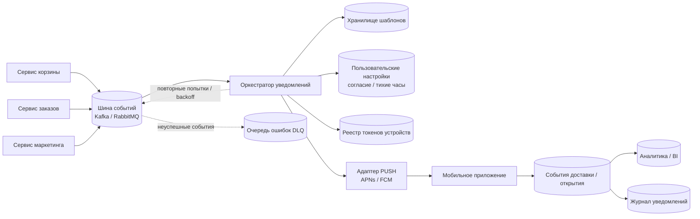

[solution_test_task_system_analyst.md](https://github.com/user-attachments/files/28997086/solution_test_task_system_analyst.md)
# Решение тестового задания (Системный аналитик)

## Задание 1. Анализ требований

### 1) Противоречия и недочеты исходного ТЗ

1. Противоречие п.2 и п.9:
   - п.2: количество нельзя уменьшить ниже 1, удаление только отдельной кнопкой.
   - п.9: при уменьшении до 0 товар удаляется.
   - Проблема: две конфликтующие модели удаления.

2. Противоречие п.7 и п.13:
   - п.7: цена фиксируется при добавлении.
   - п.13: цена автоматически обновляется при изменении в каталоге.
   - Проблема: взаимоисключающие требования.

3. Неконкретный пункт про рекламу (п.11):
   - Нет четких интервалов времени, часового пояса, условий показа.

4. Недостаточная детализация п.10-11:
   - Не определено, где показывается реклама, при пустой/непустой корзине, влияет ли на UX.

5. Пункт п.5 "Товары в корзине могут быть разные" избыточен:
   - Не добавляет проверяемого правила.

6. Не определена модель корзины:
   - Гостевая/авторизованная, синхронизация между устройствами, срок хранения.

7. Обобщенное сообщение об ошибке (п.6):
   - Пользователь не понимает, какой лимит нарушен (SKU, unique items, total qty).

8. Не описана точная формула цены:
   - Валюта, округление, скидки/промокоды, НДС.

9. Нет единых правил валидации:
   - Когда проверяются лимиты: add/update/merge корзин.

10. Формальная ошибка:
    - Пропущен номер пункта 12.

---

### 2) Исправленный фрагмент ТЗ

#### Функционал корзины

1. Пользователь может добавить в корзину от 1 до 10 единиц одного товара (SKU).
2. Пользователь может изменять количество товара в диапазоне 1..10.
3. Удаление товара выполняется только кнопкой "Удалить".
4. Максимум различных товаров в корзине: 5 SKU.
5. Суммарное количество всех единиц в корзине: не более 20.
6. При нарушении лимитов операция отклоняется, пользователь получает конкретное сообщение:
   - "Максимум 10 единиц одного товара";
   - "Максимум 5 разных товаров в корзине";
   - "Общее количество не может превышать 20".
7. Цена товара фиксируется на момент добавления в корзину и не меняется до оформления заказа или удаления позиции.
8. На странице корзины отображаются:
   - название товара;
   - количество;
   - цена за единицу;
   - сумма по позиции.
9. Отображается итоговая стоимость корзины (RUB, округление до 2 знаков после запятой).
10. В корзине может отображаться рекламный блок.
11. Рекламный блок показывается в будни (пн-пт) в интервалах 08:00-11:59 и 18:00-21:59 по локальному времени пользователя.
12. Рекламный блок не влияет на состав корзины и расчет стоимости.
13. Валидации лимитов выполняются на бэкенде при каждом изменении корзины.
14. Для авторизованного пользователя корзина хранится в профиле, для гостя - в сессии устройства.

---

### 3) Уточняющие вопросы к бизнесу/PM

1. Что считается "истиной" по цене: цена при добавлении или в момент checkout?
2. Нужна ли синхронизация корзины между устройствами?
3. Как объединяется гостевая корзина после авторизации?
4. Что делать с товарами, ушедшими в out-of-stock?
5. Есть ли TTL корзины?
6. Как применяются промокоды и скидки к фиксированной цене?
7. Какие SLA для загрузки корзины?
8. Нужны ли события аналитики (add/remove/update/view)?
9. Какой источник расписания рекламных блоков?
10. Нужны ли ограничения частоты показа рекламы?

---

## Задание 2. Проектирование REST API

### Пример запроса

`GET /api/v1/partner-stores?city=spb&limit=20&offset=0`

Headers:
- `Authorization: Bearer <token>`
- `Accept: application/json`

### Пример ответа JSON

```json
{
  "data": [
    {
      "id": "store_001",
      "title": "Фермерский двор",
      "subtitle": "Овощи, молоко, сыр",
      "imageUrl": "https://cdn.example.com/partners/farm.png",
      "redirectUrl": "https://partner.example.com/farm",
      "isActive": true
    },
    {
      "id": "store_002",
      "title": "Пекарня Утро",
      "subtitle": "Свежий хлеб и выпечка",
      "imageUrl": "https://cdn.example.com/partners/bakery.png",
      "redirectUrl": "https://partner.example.com/bakery",
      "isActive": true
    }
  ],
  "meta": {
    "limit": 20,
    "offset": 0,
    "total": 2
  }
}
```

Коды:
- `200` - успех.
- `401` - не авторизован.
- `500` - внутренняя ошибка.

---

## Задание 3. Верхнеуровневая архитектура PUSH

### Диаграмма (Mermaid)



### Краткая логика работы

1. Доменные микросервисы публикуют события в брокер.
2. `Оркестратор уведомлений` обрабатывает событие, применяет правила и выбирает шаблон.
3. Через `Адаптер PUSH` уведомления отправляются в APNs/FCM.
4. Мобильное приложение возвращает события доставки/открытия.
5. Статусы сохраняются в журнал и уходят в аналитику.

### Компоненты

1. Event Bus - асинхронная доставка событий.
2. Notification Orchestrator - бизнес-логика отправки.
3. Template Storage - шаблоны и локализация.
4. User Preferences - согласия и настройки уведомлений.
5. Device Token Registry - хранение push токенов.
6. Push Adapter - единый слой отправки в APNs/FCM.
7. Notification Log - аудит и диагностика.

### Нефункциональные требования

- Идемпотентность обработки событий.
- Retry с backoff при временных ошибках.
- DLQ для неуспешных сообщений.
- Мониторинг метрик доставки.
- Ограничение частоты push на пользователя.

---

## Что отправлять на GitHub

1. Добавить этот файл в репозиторий.
2. В README дать короткое содержание по 3 заданиям.
3. Для задания 3 уже добавлена визуальная диаграмма Mermaid.

