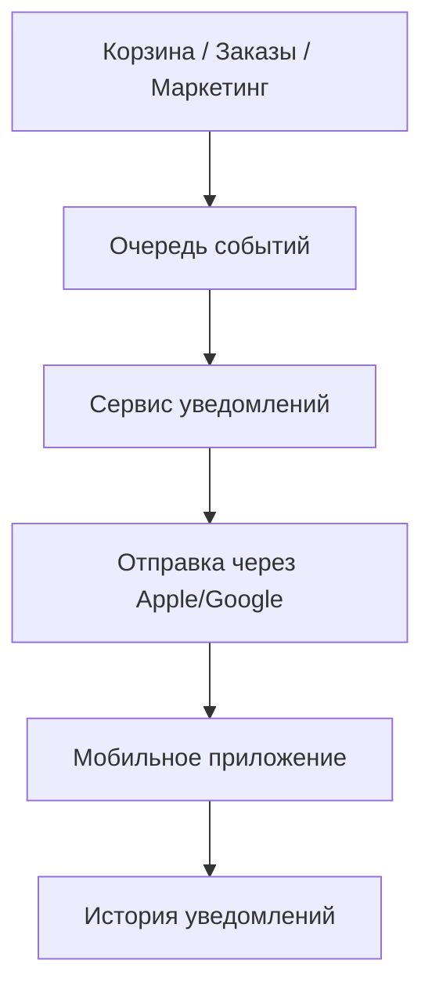

[solution_test_task_system_analyst.md](https://github.com/user-attachments/files/28997452/solution_test_task_system_analyst.md)
# Решение тестового задания (версия попроще)

## Задание 1. Анализ требований

### 1) Что не так в исходном ТЗ

1. В пунктах 2 и 9 конфликт:
   - в п.2 написано, что количество нельзя сделать меньше 1;
   - в п.9 написано, что можно уменьшить до 0 и товар удалится.
   - Надо оставить один понятный вариант.

2. В пунктах 7 и 13 тоже конфликт:
   - в п.7 цена фиксируется при добавлении;
   - в п.13 цена автоматически меняется от каталога.
   - Одновременно оба правила работать не могут.

3. Пункт 11 про рекламу слишком размытый:
   - не указан точный диапазон времени;
   - не указан часовой пояс.

4. Сообщение "Лимит корзины превышен" слишком общее:
   - непонятно, какой именно лимит нарушен.

5. Пункт "Товары в корзине могут быть разные" лишний:
   - это и так следует из других пунктов.

6. Нет базовых уточнений:
   - как хранится корзина у гостя и у авторизованного;
   - что делать со скидками и промокодами;
   - когда проверяем лимиты (только при добавлении или всегда).

### 2) Моя простая версия ТЗ для корзины

1. В корзину можно добавить от 1 до 10 штук одного товара.
2. Количество товара в корзине можно менять только в диапазоне 1..10.
3. Удаление товара только кнопкой "Удалить".
4. В корзине может быть максимум 5 разных товаров.
5. Общее количество всех товаров в корзине - не больше 20.
6. Если лимит нарушен, показываем понятную ошибку:
   - "Максимум 10 штук одного товара";
   - "Максимум 5 разных товаров";
   - "Максимум 20 товаров в корзине".
7. Цена товара фиксируется в момент добавления в корзину.
8. В корзине отображаем:
   - название товара;
   - количество;
   - цену за 1 шт;
   - сумму по позиции;
   - общую сумму корзины.
9. В корзине можно показывать рекламный блок.
10. Рекламу показываем по будням утром и вечером.

### 3) Какие вопросы я бы задал бизнесу

1. Цена должна фиксироваться при добавлении или обновляться по каталогу?
2. Нужна синхронизация корзины между устройствами?
3. Что делать с корзиной гостя после логина?
4. Как учитывать скидки и промокоды?
5. Что делать, если товара больше нет в наличии?

---

## Задание 2. Проектирование API

### Пример запроса

`GET /api/v1/partner-stores?city=spb`

### Пример ответа

```json
{
  "stores": [
    {
      "id": "1",
      "name": "Фермерский двор",
      "description": "Свежие продукты",
      "imageUrl": "https://cdn.example.com/store1.png",
      "link": "https://partner1.example.com"
    },
    {
      "id": "2",
      "name": "Пекарня Утро",
      "description": "Выпечка и хлеб",
      "imageUrl": "https://cdn.example.com/store2.png",
      "link": "https://partner2.example.com"
    }
  ]
}
```

По нажатию на карточку приложения открывает поле `link`.

---

## Задание 3. Простая схема PUSH-уведомлений

### Диаграмма (Mermaid)



### Как работает

1. В одном из сервисов происходит событие (например, заказ отменен).
2. Событие попадает в очередь.
3. Сервис уведомлений обрабатывает событие и готовит push.
4. Push отправляется через Apple/Google на телефон.
5. Пользователь получает уведомление, а факт отправки сохраняется в истории.
